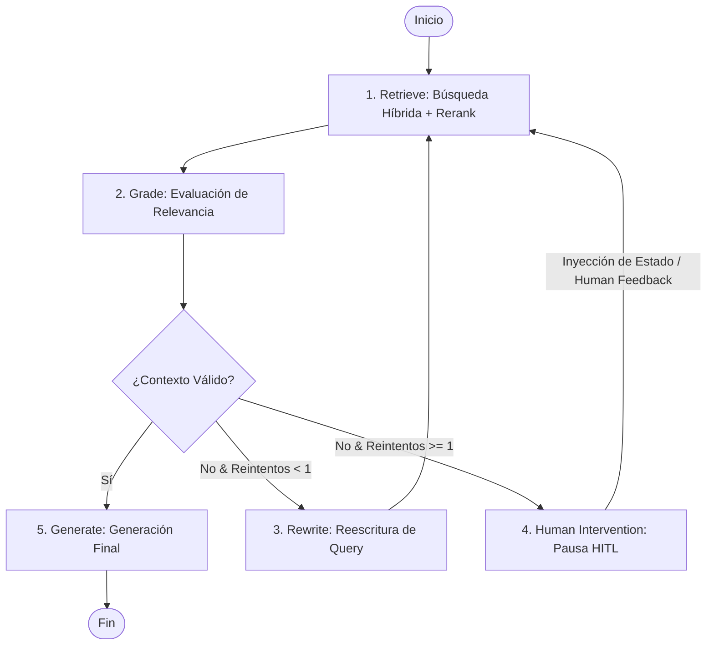
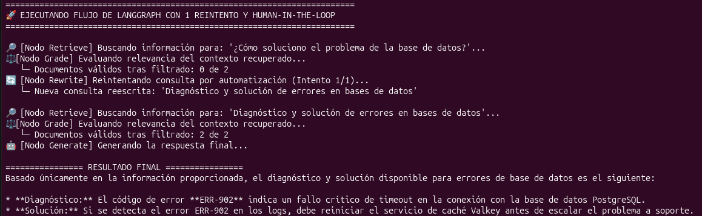
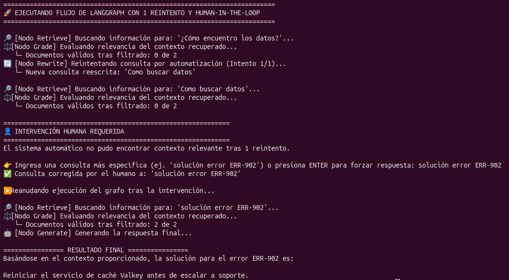

# 02. Agente RAG Auto-Correctivo con Human-In-The-Loop (LangGraph)

Este proyecto evoluciona el RAG lineal tradicional hacia un **Agente RAG Auto-Correctivo (CRAG)** guiado por estados utilizando **LangGraph**. El sistema valida autónomamente la calidad del contexto recuperado, reescribe consultas ambiguas para reintentar la búsqueda y, si agota las vías automáticas, pausa su ejecución para requerir la **intervención de un operador humano (Human-In-The-Loop)** antes de reanudar el flujo.

---

## 🛠️ Stack Tecnológico


---

## 📐 Arquitectura del Grafo

El flujo agéntico utiliza el siguiente diagrama de estados determinista compilado con `MemorySaver`:



---

## 💡 Aspectos Clave de Arquitectura

1. **Búsqueda Híbrida Avanzada:** Combina búsqueda léxica (`BM25`) y vectorial (`FAISS` + Google Embeddings), filtrada posteriormente por un modelo de re-ordenamiento multilingüe (`CohereRerank v3.0`).
2. **Filtrado Estricto de Relevancia (*Grader*):** Un nodo evalúa si el contexto recuperado responde realmente a la duda del usuario antes de enviarlo al modelo generador, evitando alucinaciones.
3. **Optimización Autónoma de Prompts:** Si el contexto no es relevante, un nodo de reescritura convierte la pregunta en una versión concisa optimizada para motores de búsqueda.
4. **Human-In-The-Loop (HITL) Nativo:**
   * Utiliza `interrupt_before=["human_intervention"]` para congelar el estado del grafo en memoria (`MemorySaver`).
   * Permite a un operador corregir manualmente la consulta en tiempo de ejecución usando `app.update_state()` y reanudar el flujo en el punto donde se pausó (`thread_id`).

---

## 🚀 Instalación y Ejecución

### 1. Requisitos Previos

Este proyecto utiliza **[uv](https://github.com/astral-sh/uv)** para la gestión rápida del entorno virtual y dependencias:

```bash
# Crear el entorno virtual con uv
uv venv --python 3.12

# Activar el entorno virtual
source .venv/bin/activate  # En Linux/macOS
# .venv\Scripts\activate   # En Windows

# Instalar dependencias
uv pip install -r requirements.txt
```

*(Alternativa rápida sin activación manual: `uv run python workflow.py`)*

### 2. Variables de Entorno

Asegúrate de contar con un archivo `.env` en la raíz con tus claves de API:

```env
GOOGLE_API_KEY=tu_api_key_de_gemini
COHERE_API_KEY=tu_api_key_de_cohere
```

### 3. Ejecución del Script

```bash
python3 workflow.py
```

---

## 📊 Ejemplo de Traza de Ejecución (Consola)

### 1. Reescritura y Recuperación Autónoma


### 2. Pausa e Intervención Humana (Human-In-The-Loop)

