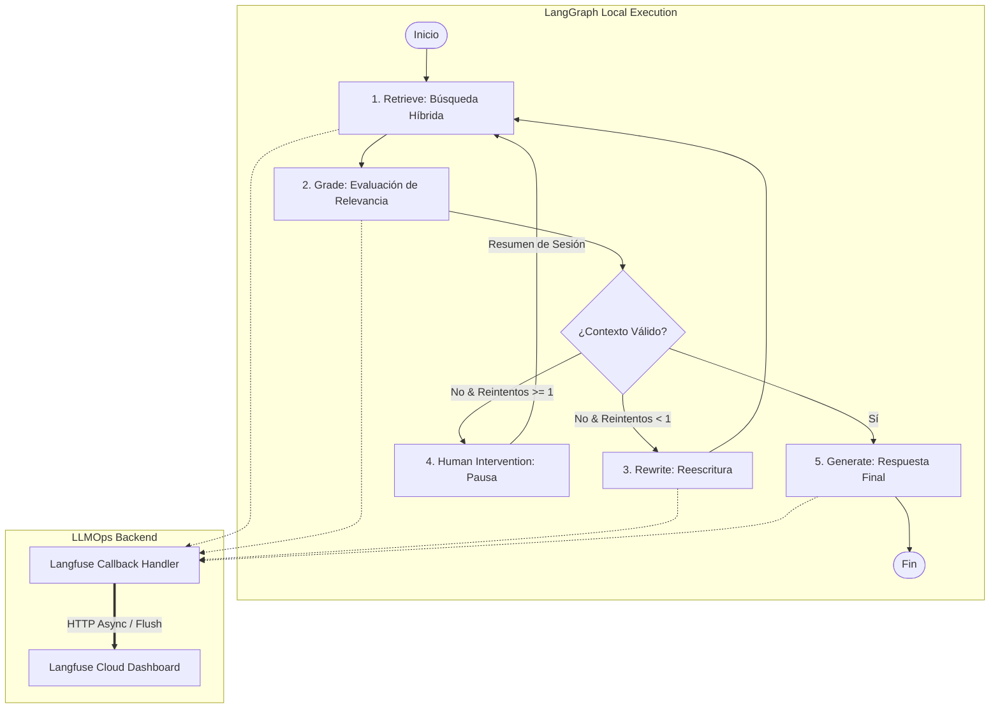
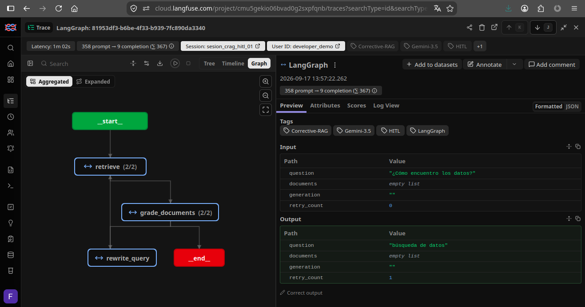
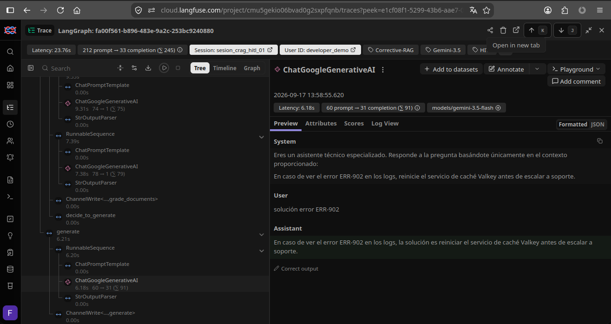
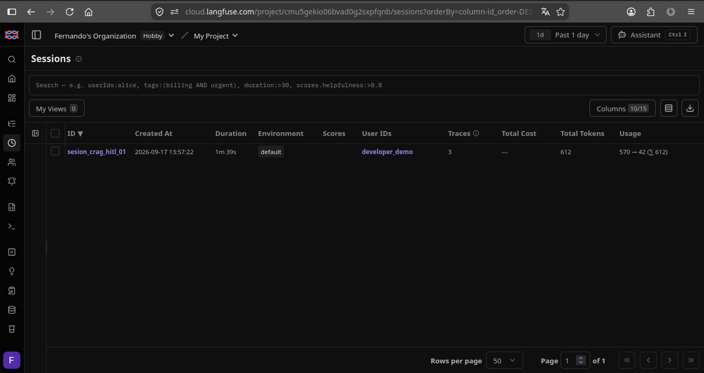

# 03. Observabilidad y Monitoreo de Agentes RAG (Langfuse)

Este proyecto integra **Langfuse Cloud** como capa de observabilidad y LLMOps sobre un **Agente RAG Auto-Correctivo (CRAG)** desarrollado en **LangGraph**. El sistema permite auditar en tiempo real la ejecución de grafos cíclicos complejos, medir la latencia paso a paso, controlar los costes de API, inspeccionar prompts/outputs por nodo y rastrear sesiones de interacción con intervención humana (**Human-In-The-Loop**).

---

## 🛠️ Stack Tecnológico


---

## 📐 Arquitectura de Trazabilidad

El flujo agéntico propaga automáticamente los callbacks de seguimiento a través del contexto de ejecución (`RunnableConfig`), enviando eventos asíncronos al backend de Langfuse Cloud:



---

## 💡 Aspectos Clave de Arquitectura

1. **Propagación Jerárquica de Callbacks (`RunnableConfig`):** Inyección nativa del `CallbackHandler` de Langfuse en cada nodo del grafo para mapear las relaciones padre-hijo entre cadenas, retrievers y llamadas a LLMs.
2. **Métricas de Rendimiento y Costes:** Cálculo automático de consumo de tokens (Input/Output), desglose de latencia individual por paso y costes estimados de API (Google Gemini y Cohere).
3. **Indexación por Sesión y Etiquetado (`Metadata`):** Agrupación de la trazabilidad mediante `session_id`, `user_id` y etiquetas personalizadas (`Corrective-RAG`, `HITL`) para realizar seguimiento multiturno tras la reanudación del grafo por un operador humano.
4. **Auditoría de Prompts y Detección de Alucinaciones:** Inspección detallada de las entradas, textos de sistema y salidas generadas en cada paso para depurar fallos en las decisiones condicionales.

---

## 🚀 Instalación y Ejecución

### 1. Requisitos Previos

Este proyecto utiliza **[uv](https://github.com/astral-sh/uv)** para la gestión rápida del entorno virtual y dependencias:

```bash
# Crear el entorno virtual con uv
uv venv --python 3.12

# Activar el entorno virtual
source .venv/bin/activate  # En Linux/macOS
# .venv\Scripts\activate   # En Windows

# Instalar dependencias exactas
uv pip install -r requirements.txt
```

*(Alternativa rápida sin activación manual: `uv run python workflow.py`)*

### 2. Variables de Entorno

Configura tu archivo `.env` en la raíz de la carpeta con las credenciales necesarias:

```env
GOOGLE_API_KEY=tu_api_key_de_gemini
COHERE_API_KEY=tu_api_key_de_cohere

# Credenciales de Langfuse Cloud
LANGFUSE_PUBLIC_KEY=pk-lf-...
LANGFUSE_SECRET_KEY=sk-lf-...
LANGFUSE_HOST=[https://cloud.langfuse.com](https://cloud.langfuse.com)
```

### 3. Ejecución del Script

```bash
python3 workflow.py
```

---

## 📊 Monitoreo y Observabilidad en Langfuse

### 1. Grafo de Estado y Árbol de Ejecución (Trace Tree)
Visualización interactive del flujo del agente, mostrando el ciclo de reintentos, el estado del grafo y las métricas acumuladas de latencia y tokens.


### 2. Auditoría Detallada por Nodo (Prompts & IO)
Inspección profunda de las variables de entrada, prompts del sistema y respuestas generadas en el nodo evaluador y generador.


### 3. Historial de Sesiones y Métricas de Usuario
Rastreo agrupado por `session_id` que refleja la interacción continua del usuario y las pausas por intervención humana (HITL).
