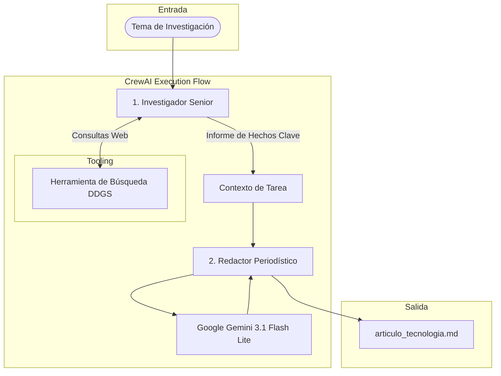
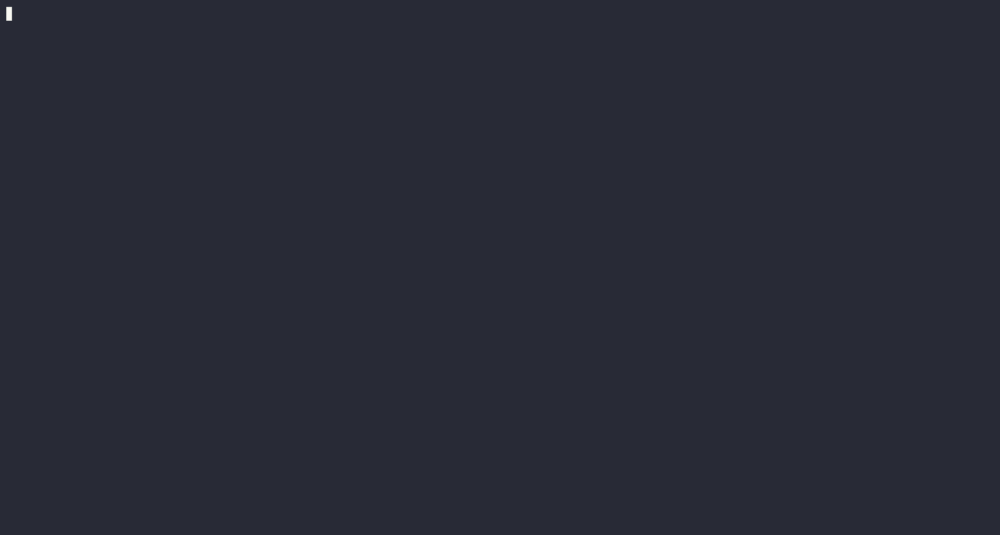

# 04. Sistema Multi-Agente de Investigación y Redacción de Noticias (CrewAI & Gemini)

Este proyecto implementa una arquitectura **multi-agente autónoma** utilizando **CrewAI** y **Google Gemini**. El sistema coordina dos agentes especializados (Investigador y Redactor) en un proceso secuencial para buscar noticias tecnológicas recientes en tiempo real con DuckDuckGo, analizar los datos y redactar artículos periodísticos estructurados en formato Markdown.

---

## 🛠️ Stack Tecnológico


---

## 📐 Arquitectura de Agentes

El flujo de trabajo se ejecuta mediante un proceso secuencial donde los resultados del agente de investigación alimentan directamente el contexto de la tarea de redacción:



---

## 💡 Aspectos Clave de Arquitectura

1. **Herramienta de Búsqueda Personalizada (`@tool`):** Creación de una herramienta nativa para CrewAI utilizando `ddgs` (DuckDuckGo Search) con manejo de contexto explícito, evitando librerías obsoletas y solucionando bloqueos de red.
2. **Optimización de Consumo y Cuota (`gemini-3.1-flash-lite`):** Integración de la variante ligera de Gemini para evitar cierres por límite de peticiones (RPM/RPD) durante los ciclos internos de razonamiento de los agentes.
3. **Orquestación Secuencial:** Encadenamiento de tareas (`Process.sequential`) donde el rol del redactor tiene restringida la alucinación, estando obligado a basarse exclusivamente en la salida auditada del investigador.
4. **Exportación Automática de Artefactos:** Configuración de persistencia en la tarea final para volcar el resultado validado directamente en un archivo Markdown estructurado.

---

## 🚀 Instalación y Ejecución

### 1. Requisitos Previos

El proyecto utiliza **[uv](https://github.com/astral-sh/uv)** para la gestión de dependencias y entornos virtuales:

```bash
# Crear el entorno virtual con uv
uv venv --python 3.12

# Activar el entorno virtual
source .venv/bin/activate  # En Linux/macOS
# .venv\Scripts\activate   # En Windows

# Instalar dependencias
uv pip install -r requirements.txt
```

### 2. Variables de Entorno

Crea un archivo `.env` en la raíz del proyecto con tu clave API de Google AI Studio:

```env
GOOGLE_API_KEY=tu_api_key_de_gemini
```

### 3. Ejecución del Script

```bash
python3 main.py
```

---

## 📊 Demostración y Resultados

### 1. Ejecución del Flujo en Tiempo Real
Animación de la terminal mostrando la inicialización del Crew, las llamadas a la herramienta de búsqueda y el proceso de pensamiento de los agentes.

<div align="center">
  
</div>

---

### 2. Artículo Generado (`articulo_tecnologia.md`)
Resultado final producido por el agente redactor e indexado directamente en la carpeta de recursos.

> 📄 **Ver artefacto generado:** [assets/articulo_tecnologia.md](assets/articulo_tecnologia.md)

---

### 3. Registro de Consola Completo (Terminal Output)

<details>
<summary><b>🔍 Ver Log de Ejecución Completo (Traza de Agentes y Herramientas)</b></summary>

```text
Para revisar el detalle completo de las trazas de ejecución, consultas a la API y razonamiento de los agentes, consulta el archivo alojado en la carpeta de assets:
```

> 📝 **Log completo:** [assets/ejecucion.txt](assets/ejecucion.txt)

</details>