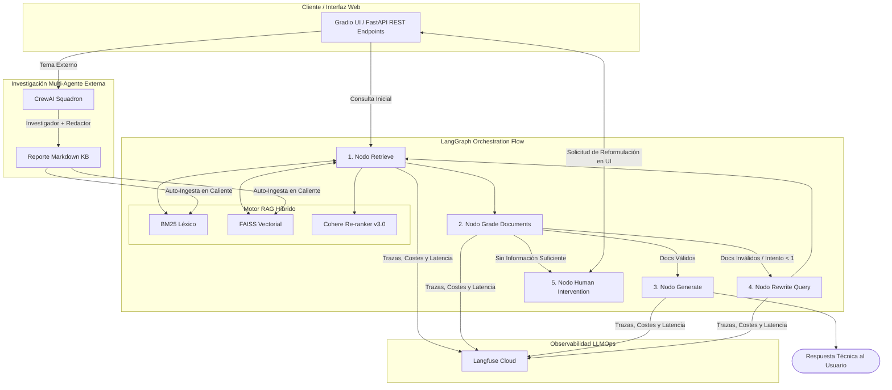

# 05. Enterprise IT Support & Knowledge Operations Center (OpsAI Copilot)

Este proyecto implementa una plataforma unificada de nivel empresarial para el soporte técnico y la gestión de conocimiento operativo. Integra **Búsqueda Híbrida (RAG)** con Re-ranking, un **Grafo Correctivo (CRAG)** con **Intervención Humana en Vivo (HITL)**, **Observabilidad LLMOps** completa y un **Escuadrón Multi-Agente** de investigación externa con auto-ingesta en caliente.

---

## 🛠️ Stack Tecnológico


---

## 📐 Arquitectura del Sistema

El sistema utiliza **FastAPI** como núcleo asíncrono sobre el cual se montan los endpoints REST y la interfaz gráfica interactiva de **Gradio**:



---

## 💡 Aspectos Clave de Arquitectura

1. **Búsqueda Híbrida y Re-ranking Multilingüe (`rag_engine.py`):** Combinación de recuperación léxica (**BM25**) y semántica (**FAISS**) procesadas por **Cohere Re-ranker v3.0** (`top_n=2`) para maximizar la precisión contextual frente a incidencias técnicas.
2. **Flujo Correctivo & Human-in-the-Loop Integrado (`graph_workflow.py` & `ui.py`):** Implementación de Corrective RAG (CRAG) con reescritura automática de consultas. Si la información no existe en el Vectorstore, el grafo pausa su ejecución (`interrupt_before`) y habilita un panel de reformulación dinámico en la misma pestaña de Gradio para reanudar el flujo en caliente.
3. **Observabilidad LLMOps en Tiempo Real (`langfuse`):** Integración nativa de `CallbackHandler` para registrar latencias de nodos, consumo exacto de tokens, evaluación estricta de documentos y auditoría de costes.
4. **Escuadrón Multi-Agente e Ingesta Dinámica (`crew_agents.py`):** Agentes de **CrewAI** (Investigador e Historiador de IT) que investigan soluciones en la web mediante DuckDuckGo y permiten auto-indexar el informe generado en el motor RAG sin reiniciar el servicio.
5. **Despliegue Unificado (`main.py`):** Aplicación `FastAPI` que integra mediante montaje nativo la interfaz web de `Gradio`, exponiendo tanto la API documentada en Swagger (`/docs`) como el dashboard visual en un solo puerto.

---

## 🚀 Instalación y Ejecución

### 1. Requisitos Previos

El proyecto utiliza **[uv](https://github.com/astral-sh/uv)** (o `venv` estándar) para la gestión de dependencias y entornos virtuales:

```bash
# Crear el entorno virtual con uv
uv venv --python 3.12

# Activar el entorno virtual
source .venv/bin/activate  # En Linux/macOS
# .venv\Scripts\activate   # En Windows

# Instalar dependencias
uv pip install -r requirements.txt
```

### 2. Variables de Entorno

Crea un archivo `.env` en la raíz del proyecto configurando tus credenciales de API:

```env
GOOGLE_API_KEY=tu_api_key_de_gemini
GEMINI_API_KEY=tu_api_key_de_gemini
COHERE_API_KEY=tu_api_key_de_cohere
LANGFUSE_PUBLIC_KEY=tu_public_key_de_langfuse
LANGFUSE_SECRET_KEY=tu_secret_key_de_langfuse
LANGFUSE_HOST=[https://cloud.langfuse.com](https://cloud.langfuse.com)
```

### 3. Ejecución del Servidor Unificado

Inicia la aplicación unificada (FastAPI + Gradio UI):

```bash
python main.py
```

* 📍 **Interfaz Web (Gradio UI):** `http://localhost:8000`
* 📍 **Documentación de API (Swagger):** `http://localhost:8000/docs`

---

## 📊 Demostración y Funcionalidades

### 1. Copiloto de Soporte Técnico e Intervención Humana (Pestaña 1)
Demostración del flujo completo de consulta técnica RAG y activación de la caja de intervención humana en vivo (HITL) dentro de la misma pestaña ante falta de contexto.

<div align="center">
  <video src="assets/Consulta.mp4" controls="controls" width="100%" style="max-height: 500px;"></video>
</div>

> 🎬 **Archivo de vídeo:** [assets/Consulta.mp4](assets/Consulta.mp4)

---

### 2. Investigación Externa Multi-Agente e Ingesta en Caliente (Pestaña 2)
Demostración de la ejecución del escuadrón de CrewAI resolviendo dudas de investigación en la web e indexando automáticamente los datos generados en el vectorstore (FAISS + BM25).

<div align="center">
  <video src="assets/Investigación_e_Ingesta.mp4" controls="controls" width="100%" style="max-height: 500px;"></video>
</div>

> 🎬 **Archivo de vídeo:** [assets/Investigación e Ingesta.mp4](assets/Investigación_e_Ingesta.mp4)

---

### 3. Traza y Monitoreo en Langfuse Dashboard

<details>
<summary><b>🔍 Ver Detalles de la Capa de Observabilidad (LLMOps)</b></summary>

Cada interacción en la interfaz web o mediante la API REST envía automáticamente las métricas al panel de **Langfuse**:
* **Trazabilidad de Nodos:** Evaluación individual de cada documento en el nodo `grade_documents`.
* **Métricas de Latencia:** Desglose del tiempo de respuesta del re-ranking de Cohere vs. la generación de Gemini.
* **Histórico de Sesiones:** Seguimiento del hilo mediante `thread_id`.

> 📄 **Dashboard de métricas:** [https://cloud.langfuse.com](https://cloud.langfuse.com)

</details>